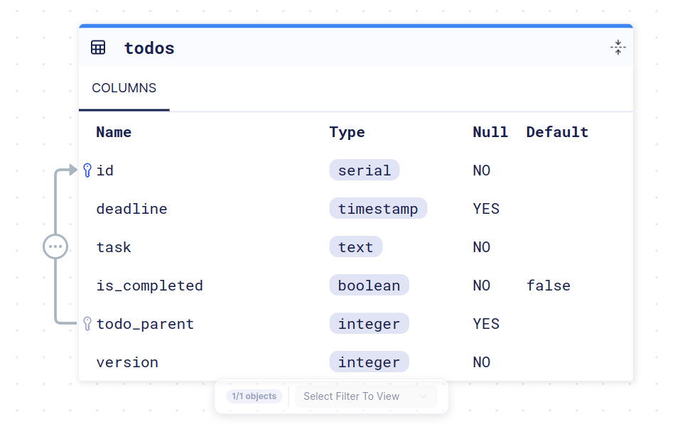

# Run a Todo Application with Docker and PostgreSQL

This documentation will guide you through the steps to set up and run a Todo application using Docker, PostgreSQL, and the Atlas migration tool.

[Demo API](https://todos-api-rahman.fly.dev/api/v1/todos)

## Prerequisites

- Docker installed on your system
- Atlas Go CLI installed on your system

## Steps

1. **Run PostgreSQL Container**

   ```bash
   docker run -d --name todo \
     -e POSTGRES_USER=todo \
     -e POSTGRES_PASSWORD=password \
     -e POSTGRES_DB=todo \
     -p 5432:5432 \
     postgres:latest
   ```

   This command will start a new PostgreSQL container with the following configuration:

   - Container name: `todo`
   - PostgreSQL user: `todo`
   - PostgreSQL password: `password`
   - PostgreSQL database: `todo`
   - Expose PostgreSQL port 5432 to the host machine

2. **Install Atlas Go CLI**

   ```bash
   curl -sSf https://atlasgo.sh | sh
   ```

   This command will install the Atlas Go CLI, which is used for database migrations.

3. **Apply Database Migrations**

   ```bash
   make atlas/migrate/apply
   ```

   This command will apply the necessary database migrations for the Todo application.

4. **Run the Todo Application**

   ```bash
   make run/live
   ```

   This command will start the Todo application and make it accessible on your local machine.

## Todos ERD


